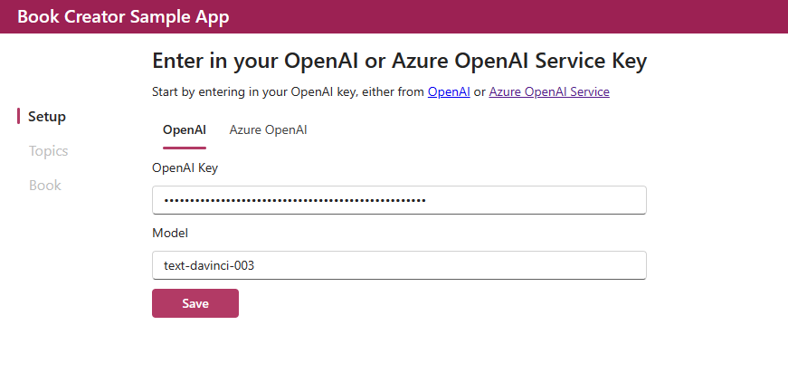

# Module 3: Lab - Book Creator application
 
 The Book creator sample application shows hows planner, skills and memories are used to enrich content for a specific use case and allows you to enter in a children's book topic then the Planner creates a plan for the functions (skills) to run based on the Ask. You can see the execution plan along with the results. The Writer Skill functions are chained together based on the user ask.

note: it is recommended that this lab exercise be done via GitHub codespaces

prerequisites
- An OpenAI or AzureOpenAI key
- Dotnet 7.0


## Running the sample

1. Fork or Clone the semantic kernel repo in GitHub

   ```
   git clone https://github.com/microsoft/semantic-kernel.git
   ```

2. Start the KernelHttpServer, this is the backend API server used by the front end React app and is the intermediary between the front end client application and OpenAI/AzureOpenAI

   ``` 
   cd samples/dotnet/KernelHttpServer
   ```

    **Run** 
    ```
    func start --csharp
    ``` 
    This will run the service API locally at `http://localhost:7071`.

3. In another terminal window, start the BookCreator web application

   `cd samples/apps/book-creator-webapp-react/`

4. Rename the `.env.example` file to `.env`.

5. Start the book creator app by running the following commands

   Install all app dependencies and start the application by running the following commands

   ```
      yarn install
      yarn start
   ```

6. A browser will automatically open, otherwise you can navigate to `http://localhost:3000` to access the application.

7. On the application main page, enter your OpenAI or AzureOpenAI key and also a value for the model ID as shown below, you may use the default **text-davinci-003** and click **Save** button

   

9. Follow the application prompts to enter a book idea and click **get Ideas** button to see some sample suggestions.

10. Select an idea option and click on the **create book** button to see the newly created book. Note: you need to additionally click on the play button as shown below on the next screen to get the book contents.

    
